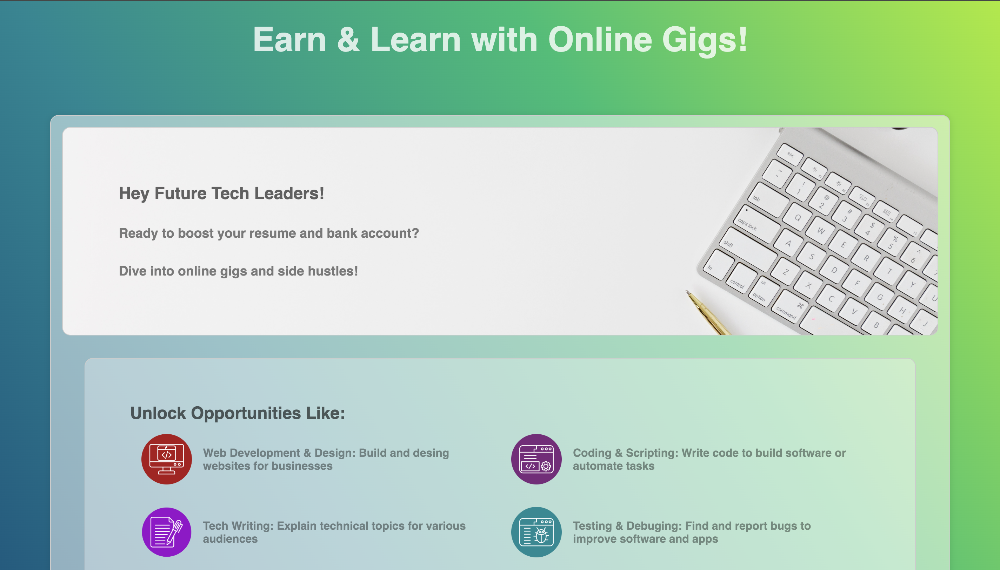
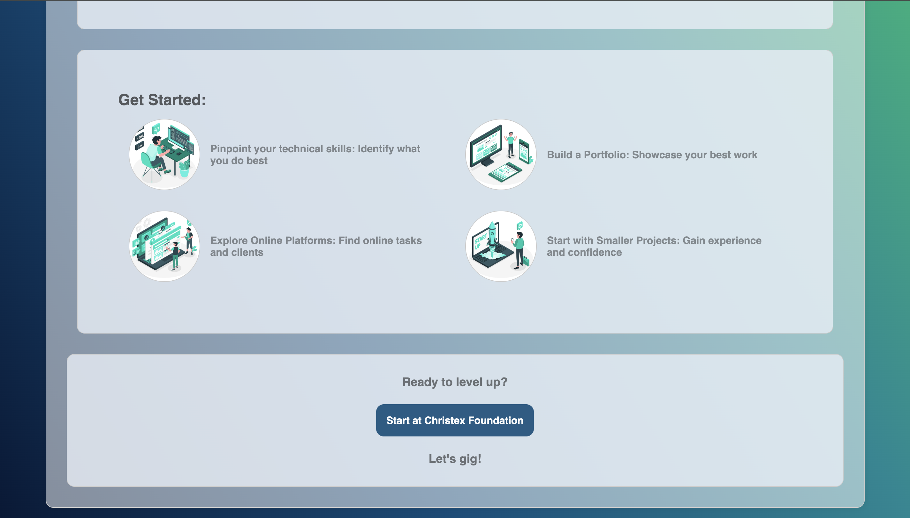
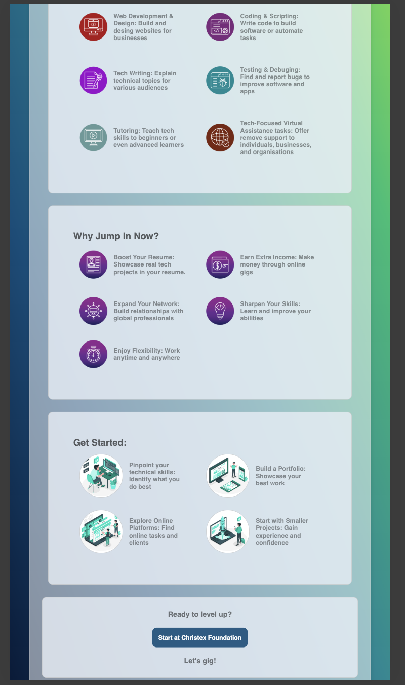

# Online Side Hustle Flyer

Welcome to the **Online Side Hustle Flyer** project!  
This flyer introduces opportunities for tech enthusiasts to boost their **skills**, **resume**, and **income** through online side hustles.

## Project Structure
```
Online_Side_Hustle_Flyer/
├── index.html                   # Main flyer webpage
├── css/
│   └── style.css                # Stylesheet
├── screenshots/
│   └── homepage1.png            # screenshot image
│   └── homepage2.png            # screenshot image
│   └── responsive-mobile1.png   # screenshot image
│   └── responsive-mobile2.png   # screenshot image
└── README.md                    # Project documentation
```

## Features
- Smooth **zoom animations** and **hover effects** on cards and a button.
- Fully **responsive layout** for all screen sizes.
- Clean, easy-to-navigate flyer design.

## Technologies Used
- **HTML5**  
- **CSS3** (with transitions and grid/flex layouts)  

##  How to View Locally
1. Clone the repository:
   ```bash
   git clone https://github.com/your-username/Online_Side_Hustle_Flyer.git
   ```
2. Open the project folder:
   ```bash
   cd Online_Side_Hustle_Flyer
   ```

3. Open `index.html` directly in your browser.
## Live Demo
[Visit ➔](https:// /)

## Screenshots

### Desktop View



### Mobile View



## Author
- **Ibrahim Sorie Bangura** 

## License
This project is for educational and promotional purposes under Christex Foundation.  